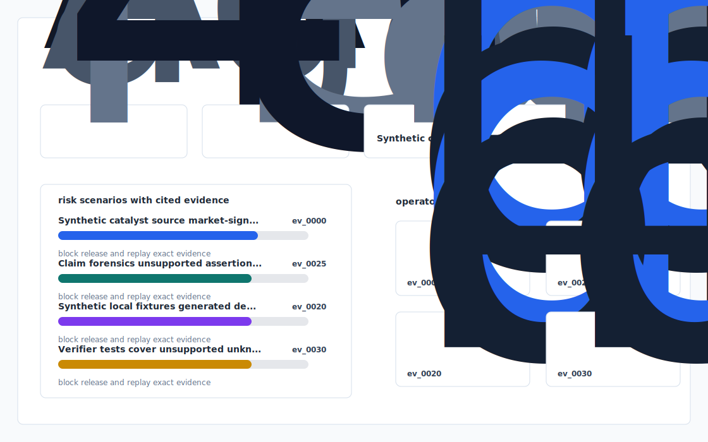
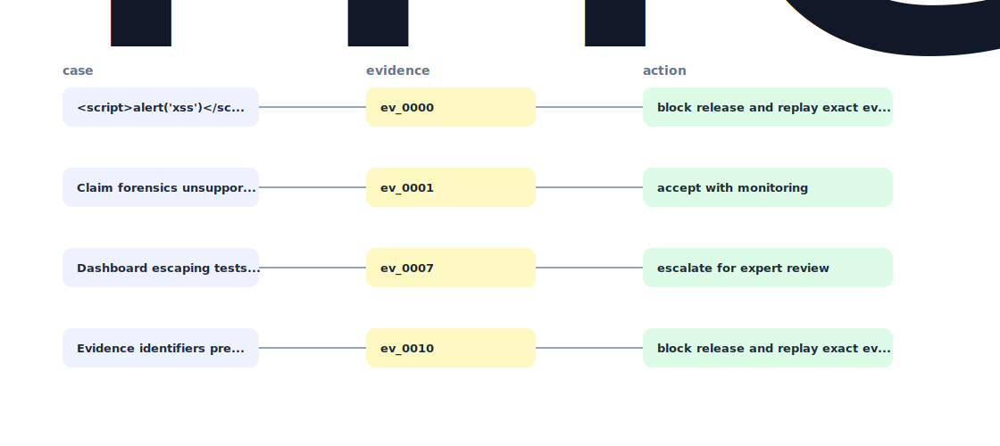

# Alpha Memo Forensics Engine


A local research-quality prototype for checking synthetic investment memo claims against evidence, freshness, contradiction, and traceability signals.

`memo-claim-forensics` favors explicit fixtures, deterministic checks, and reviewable artifacts over hidden services or live data.

## Decision surface

Alpha Memo Forensics Engine: Citation-Grade Investment Research With Contradiction Tracking.

## Evaluator shape

- Synthetic memo, catalyst, source, and market-signal records.
- Claim forensics for unsupported assertions, stale evidence, and contradiction risk.
- Verifiable reports, CSV findings, and an offline analytics dashboard.

## Quick path

```bash
uv sync
uv run app init-demo
uv run app ingest fixtures/
uv run app analyze
uv run app verify
uv run app dashboard
uv run app benchmark
uv run app export-demo-pack
uv run pytest -q
uv run ruff check .
```




## Materialized results

- `outputs/dashboard.html`
- `outputs/decision_report.md`
- `outputs/evidence_graph.mmd`
- `outputs/risk_or_quality_report.csv`
- `outputs/benchmark.md`
- `outputs/demo_pack.md`

## Acceptance checks

```bash
uv run ruff check .
uv run pytest -q
uv run app verify
```

## Repo boundary

Every example in `memo-claim-forensics` is fabricated for repeatability. Generated outputs are rebuildable artifacts, not source material.
